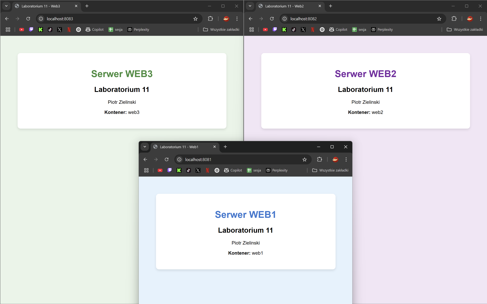

# Laboratorium 11 - Docker Network i Nginx

## Przygotowanie środowiska

### 1. Utworzenie sieci Docker
```bash
docker network create lab11net
```

### 2. Utworzenie woluminu dla logów
```bash
docker volume create lab11-logs
```

## Uruchomienie kontenerów

### Serwer WEB1 (port 8081)
```bash
docker run -d \
  --name web1 \
  --network lab11net \
  -p 8081:80 \
  -v "$PWD/html/index1.html:/usr/share/nginx/html/index.html:ro" \
  -v lab11-logs:/var/log/nginx \
  nginx:latest
```

### Serwer WEB2 (port 8082)
```bash
docker run -d \
  --name web2 \
  --network lab11net \
  -p 8082:80 \
  -v "$PWD/html/index2.html:/usr/share/nginx/html/index.html:ro" \
  -v lab11-logs:/var/log/nginx \
  nginx:latest
```

### Serwer WEB3 (port 8083)
```bash
docker run -d \
  --name web3 \
  --network lab11net \
  -p 8083:80 \
  -v "$PWD/html/index3.html:/usr/share/nginx/html/index.html:ro" \
  -v lab11-logs:/var/log/nginx \
  nginx:latest
```

## Dostęp do aplikacji

- **WEB1**: http://localhost:8081
- **WEB2**: http://localhost:8082  
- **WEB3**: http://localhost:8083

## Zarządzanie kontenerami

### Zatrzymanie wszystkich kontenerów
```bash
docker stop web1 web2 web3
```

### Usunięcie kontenerów
```bash
docker rm web1 web2 web3
```

## Sprzątanie

### Usunięcie sieci i woluminu
```bash
docker network rm lab11net
docker volume rm lab11-logs
```

### Zrzuty ekranu

## Uruchomione serwery


## Uruchomione kontenery


## Volumes
